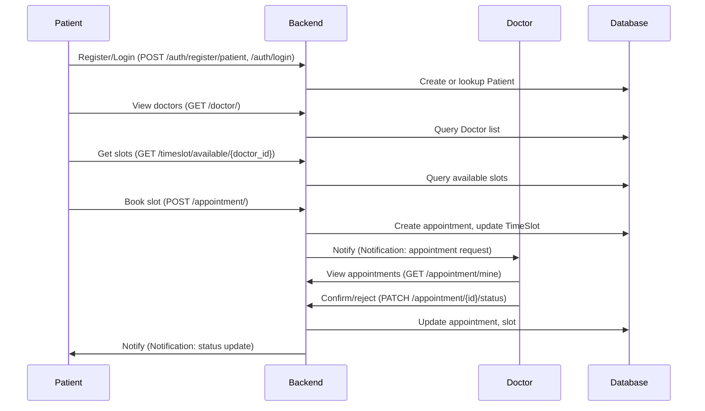

## Appointment Booking Flow

Here is the typical booking process in the system:



### Summary

- Only authenticated users can book, confirm, or manage appointments.
- Patients can only book for themselves.
- Doctors can only manage their own slots and can accept or reject bookings.
- Notifications are created for both parties as relevant events occur.

---

## Authentication System

Authentication is handled using JSON Web Tokens (JWT), managed in `src/api/auth.py`:
- On registration or login, users receive a signed JWT (`access_token`) which must be presented with the `Authorization: Bearer <token>` header for all protected API calls.
- JWTs encode the user's identity and type (patient/doctor), which is used for role-based permissioning throughout the API.
- Tokens expire after 24 hours by default, and can be invalidated by making a user inactive.

**Key functions and logic:**
- `create_access_token`: Generates a JWT with `user_id` and role.
- `decode_access_token`: Parses and verifies the token.
- `get_current_user`: Dependency for protected routes, fetches the active user based on JWT.
- Registration endpoints (`/auth/register/patient`, `/auth/register/doctor`) assign role at account creation.

---

## Notification System

The notification feature notifies users (patients/doctors) of booking events and appointment status changes.

- Every booking/pending action creates a notification for the doctor.
- Confirmation/rejection by the doctor creates a notification for the patient.
- Each notification includes a type (request/update/general), a message, and read/unread status.
- Endpoints allow users to fetch their notifications, mark as read, or query by ID.

### Notification Flow Example

```mermaid
flowchart TD
    Book["Patient books appointment"] -->|Creates| N1["Notification: APPOINTMENT_REQUEST to Doctor"]
    Confirm["Doctor confirms appointment"] -->|Creates| N2["Notification: APPOINTMENT_UPDATE to Patient"]
    Reject["Doctor rejects appointment"] -->|Creates| N3["Notification: APPOINTMENT_UPDATE to Patient"]
    N1 & N2 & N3 -->|Visible in| "GET /notification/mine"
```

---

## Dependency Explanation

Main Python dependencies declared in `requirements.txt`:
- **FastAPI**: Web API framework.
- **SQLAlchemy**: ORM for DB management.
- **Pydantic**: Data validation.
- **PyJWT/jose**: JWT token handling.
- **passlib**: Secure password hashing.
- **Uvicorn**: ASGI server for app startup.
- **pytest**: Testing support.
- Includes other supporting libraries (CORS, dotenv, rich, python-multipart, etc.).

---

## Setup and Running Instructions

1. **Install Python Dependencies**  
   ```sh
   cd appointment_backend_api
   pip install -r requirements.txt
   ```

2. **Configure Environment Variables (Optional)**  
   - `DATABASE_URL` (e.g., for PostgreSQL: `export DATABASE_URL=postgresql://user:pw@localhost/dbname`)
   - `JWT_SECRET_KEY` (set for production security)

3. **Initialize Database (if empty)**  
   SQLAlchemy will create all tables based on models at first run or you can use Alembic/migrations if preferred.

4. **Run the Server**  
   ```sh
   uvicorn src.api.main:app --reload
   ```
   App will be available at `http://127.0.0.1:8000/`

5. **Interact with API docs**  
   FastAPI Swagger UI: [http://127.0.0.1:8000/docs](http://127.0.0.1:8000/docs)

---

## Test Coverage

Automated test cases in the `tests/` directory:
- Registration and login tests (patients, doctors)
- Booking and viewing appointment flow
- Notification endpoint tests
- Slot CRUD and authorization
- Profile endpoint behavior

Run all tests with:
```sh
pytest
```

---

## Core Design Decisions

- **Unified User Model**: One `User` table (type: patient/doctor) with related profile tables for patient/doctor attributes for better scalability and query-ability.
- **Role-Based Access Control**: All protected endpoints check role and identity via JWT. Patients and doctors are isolated to their own data.
- **Notification as First-Class Resource**: Built-in notification resource supports extensibility for new notification types and future features.
- **Scalable API Structure**: Each domain (user, doctor, appointment, etc.) has its own FastAPI router file, and common Pydantic schemas for robust, testable contracts.
- **SOLID, DRY Principles**: Code separated for testability and maintenance; minimal duplication between patient/doctor logic.
- **CORS Middleware**: Allows React frontend (on different port/origin) to access backend safely during development.

---

## Additional Resources

- **OpenAPI Schema**: See [`./interfaces/openapi.json`](../interfaces/openapi.json)
- **Source code**: Under [`src/api/`](../src/api/)
- **Sample tests**: [`tests/`](../tests/)

---

Task completed: Comprehensive backend FastAPI documentation (with API, flows, diagrams, usage instructions, and explanations) written to kavia-docs/README.md.
